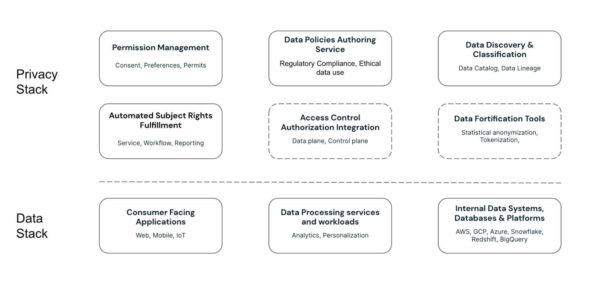
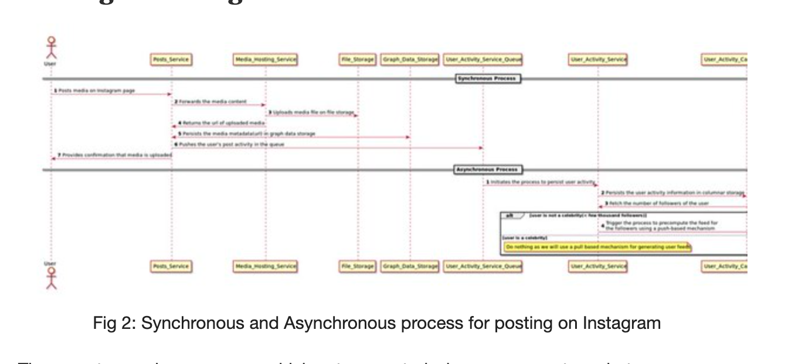

# Privacy Stack Reference Architecture v1
# Problem Statement

Empower technologists to architect, design, build and maintain systems that respect privacy by design and process data ethically. The right solution is the one that can be implemented once and withstand the changing regulatory compliance landscape. By clearly articulating the tradeoffs such solution supports both securing the data and extracting value from data. With the right set of controls in place every stakeholder can act independently to orchestrate an organization’s posture towards privacy compliance.

# Gathering Requirement

## In Scope
<ol>
<li>
<b>Purpose</b> - Make purpose a ‘first-class citizen’ in the consideration set for processing data through systems to **declare</b> <b>enforce</b> and <b>audit</b> permissions.
<li><b>Control</b> - Afford data owners the means to control their data through the <b>granting</b> <b>revoking</b> and <b>enforcing</b> of permissions and the ability to execute data <b>control operations</b></li>
<li><b>Recognition</b> - Make explicit the <b>recognition</b> and identification of all entities participating in the data transaction with associated <b>registration</b> <b>verification</b> and <b>revocation</b> procedures.</li>
<li><b>Transmission</b> - Support transmission of instructions and permissions from end to end across data supply chains through <b>subscription</b> and <b>broadcasting</b> procedures across the chain and <b>auditing</b> and <b>enforcement</b> procedures within each link.</li>
<li><b>Rectification<b/> - Take remedial steps to <b>rectify</b> instances when permissions or instructions are not respected and <b>monitor</b> and <b>alert</b> for such instances.</li>
</ol>

_Copied from the IG example, to support our pattern matching_

* Users should be able to upload photos and view the photos they have uploaded
* Users should be able to follow other users
* Users can view feeds containing posts from the users they follow

## Out of Scope

- Design and implementation of the required identity systems
- Some topics concerning general security of the system, like the encryption protocols for data at rest or in transit.
- Trusted path
- Process-oriented strategies that ensure a deployment supports an organization’s legal policies and agreements.

_From the IG example, for pattern matching_

- _Sending and receiving messages from other users_
- _Generating ML based personalized rec's to discover new content and people_

 
 

# The Privacy Stack

_Describes the structure of this section of the document. The subsections on each archetype scenario are standalone, with the exception of more complicated archetypes that may require reading the Simple app + the more complex archetype scenario. Imagine the reader is interested in supply chain … the reader’s attention is on Simple + Supply Chain._

* Components (?)
* The functions (e.g. post a picture to Instagram [Fig 2.](https://live.staticflickr.com/65535/51824416827_25bdf72ec6_h.jpg))
    * Constructing data catalog (metadata)
    * Obtaining permissions
    * Defining policies
    * Purpose limitation processing and access control
    * Respecting DSRs – delete, port etc.
    * Controller ⇔ Processor
    * Supply chain permissioning 
* The archetype scenarios:
    * Simple app - client, server, database
    * Advance app - adding 3rd party data integrations (orchestration)
    * Processor app - adding multi tenant
    * Supply chain - nth party chain of permissions

# Simple app
## Architecture

An example of the most basic application setup consisting of clients, mobile and desktop, and a back-end server and a database. Such applications support serving up pages and content, and may offer additional functionality such as personalization. Users of the app provide information to support a range of offerings, such as authentication and identity verification, payments and shipment when relevant, and preferences such as likes and dislikes. Data is collected explicitly, such as web forms, and/or implicitly, such as identifiers/cookies…

## Privacy Stack System Components

## Component Design (relevant functionality)

System components ->  privacy stack components 

* Constructing data catalog (metadata)

## API Design

How do you ask for permissions? 

Consent API: obtain, modify, propagate

Within the API design we may have branches:

- User has one identity
- User may have more than one identity

# Advanced application

## Architecture

## Privacy Stack System Components

## Component Design (relevant functionality)
System components ->  privacy stack components 

## API Design

# Processor application

## Architecture

## Privacy Stack System Components

## Component Design (relevant functionality)

System components ->  privacy stack components 

## API Design

# Data Supply Chain Ecosystem

## Architecture

## Privacy Stack System Components

## Component Design (relevant functionality)
System components ->  privacy stack components 

## API Design

# Data models
## Permit
## Metadata
## Policies
# References
