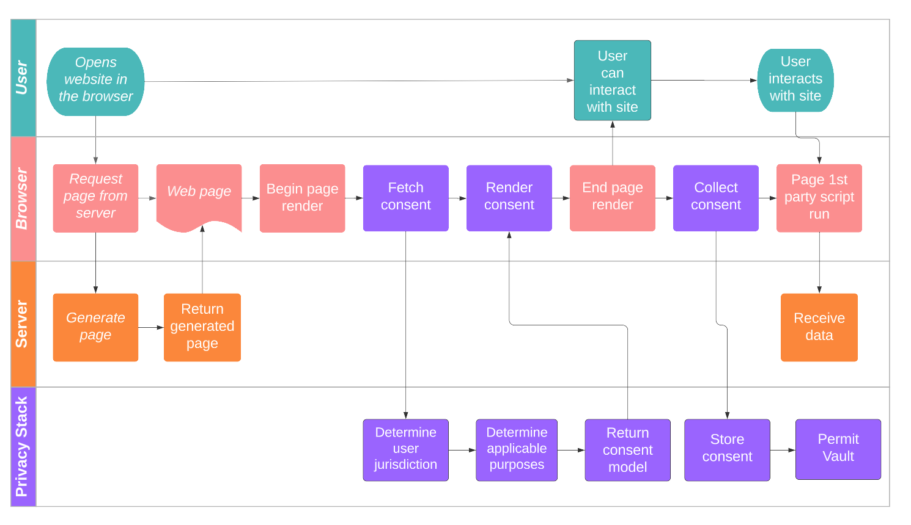

# Table of Contents

- [Problem Statement](#problem-statement)
- [Gathering Requirements](#gathering-requirements)
    - [In Scope](#in-scope)
    - [Out of Scope](#out-of-scope)
    - [Document Structure](#document-structure)
- [Working Pieces of a Privacy Stack](#working-pieces-of-a-privacy-stack)
- [Simple Application](#simple-application)
    - [Architecture](#architecture)
    - [Privacy Stack System Components](#privacy-stack-system-components)
        - [Data Policies Authoring Service](#data-policies-authoring-service)
        - [Permission Management](#permission-management)
        - [Consent Management API Design](#consent-management-api-design)
        - [Automated Subject Rights Fulfillment](#automated-subject-rights-fulfillment)
        - [Access Control Authorization Integration](#access-control-authorization-integration)
        - [Data Fortification Tools](#data-fortification-tools)
- [Advanced Application](#advanced-application)
    - [Architecture](#architecture-1)
    - [Privacy Stack System Components](#privacy-stack-system-components-1)
        - [Permission Propagation to Processors](#permission-propagation-to-processors)
        - [External Automated Subject Rights Fulfillment](#external-automated-subject-rights-fulfillment)
- [Processor Application](#processor-application)
    - [Architecture](#architecture)
    - [Privacy Stack System Components](#privacy-stack-system-components-2)
        - [Permission Management](#permission-management-1)
        - [Subject Right Fulfillment Module](#subject-right-fulfillment-module)
        - [Aggregated Data](#aggregated-data)
- [Glossary](#glossary)
- [References](#references)

 

# Problem Statement

The legal and corporate implications of compliance with privacy regulations have attracted a great deal of attention and work. However, for an organization to become compliant, nontrivial technical changes in how it collects, stores, processes, and shares data must occur. In comparison, little has been discussed about such technical implications, with some notable exceptions1,2,3. This document outlines for a technical audience and, in technical terms, a blueprint for an architecture that natively and by design respects data privacy and the ethical use of data.

Ideally, this architecture is flexible enough to sufficiently contemplate present as well as future regulatory compliance requirements, buffering against a need to frequently rearchitect. By clearly articulating the tradeoffs, such an architecture supports both securing the data and extracting value from data. With the right set of controls, every stakeholder can act independently to orchestrate an organization’s posture toward privacy compliance.

Most technologists’ mental model of data privacy has traditionally been limited to rudimental consent collection, a cookie banner on a website. This document aims to move the industry towards a much more robust data privacy stance - that collecting and processing every piece of data for every purpose must have a legitimizing reason, i.e., permission. When coupled with the reality of the modern data stack with its multi-component backend architecture, this fundamental shift is the core driver of the complex and costly technical implications of compliance with privacy regulations. In essence, this shift introduces a fine-grain level of control to data access and use that technologies and architectures previously built to handle data have not contemplated at design time. To address this, the approach proposed here advocates for a dedicated stack, termed the _Privacy Stack_, of components that are integrated into and interoperate with the traditional data stack but are otherwise independent.

 
 

# Gathering Requirements

## In Scope

Technical mechanisms to be implemented by all parties who collect, store, and process data organized into these five categories:

1. **Purpose** - Make purpose a ‘first-class citizen’ in the consideration set for processing data through systems to **declare**, **enforce**, and **audit** permissions.
2. **Control** - Afford users the means to control their data through the **granting**, **revoking**, and **enforcing** of permissions.
3. **Recognition** - Make explicit the **recognition** and identification of all entities participating in the data transaction with associated **registration**, **verification**, and **revocation** procedures.
4. **Transmission** - Support transmission of instructions and permissions from end to end across data supply chains through **subscription** and **broadcasting** procedures across the chain and **auditing** and **enforcement** procedures within each link.
5. **Rectification** - Take remedial steps to **rectify** instances when permissions or instructions are not respected and **monitor** and **alert** for such instances.

## Out of Scope

1. Design and implementation of the required identity systems
2. Some topics concern the general security of the system, like the encryption protocols for data at rest or in transit.
3. Process-oriented strategies that ensure a deployment supports an organization’s legal policies and agreements.

## Document Structure

The document introduces the Privacy Stack by exploring four architectures that build on one another in complexity. The four archetype architectures are:

* Simple app - client, server, database
* Advance app - adding 3rd party data integrations (orchestration)
* Processor app - adding multi-tenant
* Supply chain - nth party chain of permissions

For each of those architectures, the relevant privacy stack components and their design are outlined. Specifically, the component design is motivated where relevant by the following functional requirements associated with compliance:

* Constructing data catalog
* Respecting consent
* Respecting Data Subject Rights – access, delete, port, etc.
* Defining policies
* Purpose limitation processing and access control
* Controller ⇔ Processor
* Supply chain permissioning

 
 

# Working pieces of a Privacy Stack

In this section (and in the rest of this document), we describe the key terms of a privacy stack for an organization that collects information about and from their users to provide a product or services. Depending on where these users reside, there are legal ramifications for how this data must be collected, stored, accessed, used, and shared.

## Terms

* **jurisdiction:** the laws and regulations that govern the collection, use, and protection of personal data within a specific geographic area
    * **example:** EU countries that are subject to General Data Protection Regulation (GDPR)
* **purpose:** the specific reason for which personal data is collected, processed, and used. The purpose for collecting personal data must be communicated to the data subjects apriori, and the collected data must only be used for the specific purposes identified and consented to.
    * **example:** marketing
* **legal bases:** the legal grounds based on which user data is handled by the organization 
    * **example:** in the jurisdiction of the EU, for the purpose of marketing, under GDPR, the legal basis is opt-in consent.
* **Consent:** the act of a user permitting an organization to collect, use, or share their data. This usually involves affirmative action, such as ticking a box or clicking a button, indicating that the individual understands and agrees to the terms of the data collection.
    * **example:** Ryan visits nytimes.com and is presented with a pop-up window asking for permission to collect and use his personal information for specific purposes, such as personalized advertising or market research. If Ryan clicks "Agree" or "Accept," this would be considered Ryan giving his consent for the website to collect and use his data as specified. Additionally, Ryan should be provided with information about what data is being collected, why it is being collected, and with whom it will be shared in a clear and easily accessible manner. Ryan may return anytime and change his mind on any consent decision.
* **Permit:** the representation of the contract or agreement which provides a legitimizing reason to access, store, and use each datum. Permits are stored in a permit vault and play four key roles:
    * Collectively, they form the System Of Record for what can and cannot be done with the data.
    * They form the basis for the signals sent across the data ecosystem to enable compliant data usage.
    * They facilitate permitted access control with appropriate enabling technologies integrated into data stores and runtime environments. 
    * Endowed with appropriate cryptographic material, they support data security and enable fine controls.

	The core tenets of a permit are:
    * **Agreeing parties**– the entities that grant and obtain the permit. Most commonly, a data subject (user) and an organization, respectively.
    * **Scope**– the scope of data managed by a permit, including the purpose for which data is used.
    * **Conditions**– conditions to satisfy for the permit to be valid. Most commonly, the explicit consent from the data subject. Additional conditions include the period of validity.
* **permission:** the effect of a valid permit, interpreted as the permission to access and process a scope of data according to a set of conditions. Operationally, permission is an access control and authorization requisite. When the scope of data is subject to privacy regulations, permission requires consent. In such cases, permission can be viewed as the technical representation of consent, translating consent into access permission for processes to access the data.
    * **example:** the user with identity ryan@ketch.com has permitted their data to be used in marketing applications
* **policy** a set of conditions applied to a scope of data that, when met, enable and enforce the requisite pattern of access and use of the data. Policies define the terms of the agreement implemented in permits and form the translation layer between the corporate, legal, and human world of privacy and the systems and technologies that manage the data. A policy is made of two parts, the Scope and the Effects. The **scope** of a policy defines the set of data to which the policy applies. The scope is defined using the following objects:
    * **Purpose** – data that can be accessed for a specific purpose
    * **Resource** – a technology like a database, a schema, or even a table
    * **Tags** – metadata associated with the data, for example, sensitivity level

    The **effect** of a policy defines the type of access granted to the data in scope. This includes binary access, such as Grant or Deny, and type of access, such as Read or Write. It may also include conditional access. Finally, effects can specify transformations required for the data, such as statistical anonymization techniques like differential privacy and k-anonymization, as well as various cryptography methods like hashing and homomorphic encryption.

    * **example:** analysts at the New York Times have permission to perform SELECT queries on the `subscribers` table for the purpose of ANALYTICS but only when consent is granted by the subscriber. An additional effect may describe the necessary transformation of specific fields; for example, the age column must be statistically anonymized using differential privacy.
* **data subject right:** originating in GDPR6 but applies to all users under various privacy regulations. As a user of any service, you have the right to obtain a copy of your information, request deletion of your data, opt out of the sale of your data, etc. Organizations must afford these rights to their users.
    * **example:** the right to access personal data. This right allows users to request a copy of any personal data that an organization holds about them.
* **controller:** a controller refers to the entity that determines the purpose and means of processing of a user’s personal-data. 
    * **example:** if a user visits the New York Times website, the New York Times would be considered the controller.
* **processor:** a processor refers to any subsequent service provider the controller has contracted to help it process the data.
    * **example:** if the New York Times uses Marketo as its marketing system, Marketo would be considered the processor.
* **data supply chain:** a chain of entities, starting with a controller, that collect, share, transform, and augment the data to support a product or service. 
    * **example:** the process of collecting user data for targeted advertising. The data supply chain in this example would involve
        1. Data collection: An application collecting user data through forms, cookies, or other tracking technologies.
        2. Data processing: A data analytics firm that processes the collected data to create profiles of the users and identify their interests.
        3. Data storage: A cloud storage provider storing the processed data.
        4. Data usage: An advertising platform that uses stored data to target users with personalized ads.
* **identity management**: the act of knowing who a data subject is online. Identity management is closely related to privacy management — only if an organization knows who you are can they keep your specific data private and afford you your rights. There are many different notions of identity online, including device ID, cookies in the browser, hashed email, and other third part identifiers. It’s best practice in privacy management to gather as many identifiers as needed from one session while respecting the data minimization principle.
    * **example:** if you go to an internet cafe and log into your New York Times account, one identifier is the cookie is persisted in the browser. Another, stronger identifier is the logged-in ID. When you later invoke your data subject rights and request that the New York Times delete all your data, there might be very little data associated with that cookie (since you normally read the New York Times at home); Therefore, it is important to include all relevant identifiers on the page.

 

|  | 
|:--:| 
| **Figure 1: Privacy in the Data Supply Chain** |

**Purpose:** How can users both permit and define the purpose for which their data is issued?

**Control:** How can users trust they have the controls to read and write permissions?

**Recognition:** How can users recognize to whom data and permissions are transferred?

**Transmission:** How can permissions be transmitted across the data supply chain?

**Rectification:** How can remedial steps be taken to rectify instances when permissions or instructions are not respected? 

 

## Working pieces example

A **data subject/user** in France visits nytimes.com. The New York Times wants to collect the user’s email address for the **purpose** of marketing. Since the user lives in the **jurisdiction** of EU countries under GDPR, the **legal basis** requires that the New York Times obtain opt-in **consent**. The New York Times shows the user a pop-up modal asking the **data subject** to check a box and confirm that they are ok with their email address being collected for the **purpose** of marketing. Once the data subject clicks the confirm button, the New York Times has a permit stating that it has permission to use its email address in its marketing campaigns.

Internally, within the New York Times’ privacy stack, the **permit** is operationalized with **policies** that define access to data assets and resources. These policies apply to both employees and software systems attempting to access the data.

In this setup, the New York Times is a controller, because it determines the why and the how of processing the user’s data. The New York Times also interacts with other organizations that process its data, which are called **processors**, for example, Marketo. The New York Times and Marketo are two entities within a **data supply chain** and have privacy obligations to each other and the end data subject. The data should be shared and used by processors based on permissions and policies, and permits should be propagated throughout the ecosystem.

 
 

# Simple Application

## Architecture

The most basic application setup consists of a client, mobile and desktop, a back-end server, and a database. Such applications support serving up pages and content and may offer additional functionality such as personalization. Users of the app provide information to support a range of offerings, such as authentication and identity verification, payments and shipment when relevant, and preferences, such as likes and dislikes. Data is collected explicitly, such as web forms, and/or implicitly, such as identifiers/cookies and logs.

 

|  | 
|:--:| 
| **Figure 2: Simple Application Architecture** |

 

## Privacy Stack System Components

 

|  | 
|:--:| 
| **Figure 3: Privacy Stack Components for a Simple Application** |

 

The privacy stack for a simple application includes the components below:

### Data Policies Authoring Service

 

|  | 
|:--:| 
| **Figure 4: Data Policies Authoring Service** |

 

The data policies authoring service is where the various data rules for different jurisdictions are created and updated. It is accessed only by the organization. So for example, one rule might be that if the data is being collected in California, then you have to allow users to opt out of their data being used for machine learning model training.

**Input:** legal regulations

**Output:** the notion of jurisdictions and how data should be treated in each one of them

### Permission Management

The permission management component holds all the logic around asking users for consent to collect their data and translating consent into permissions.

 

|  | 
|:--:| 
| **Figure 5: Example consent management UI** |

|  | 
|:--:| 
| **Figure 6: Consent flow as part of permission management** |

 

As shown in this diagram, the initial “consent-getting” flow does the following:

* **The browser makes a request to the consent management component**, passing along the cookie or another identifier.
* **When the consent management service receives this request it:**
    * **Determines user jurisdiction:** the service can determine the user jurisdiction by looking at the IP. The user might also have passed along a more declarative notion of location.
    * **Calls data policies authoring service:** the service calls the **data policies authoring service** to figure out the specific rules for the jurisdiction (what sorts of consent need to be collected).
    * **Determines applicable purposes for the data:** as different jurisdictions have different rules and regulations about how and why data is collected, an organization may define different purposes for collecting this information.
    * **Ascertains whether this user already consented to the relevant purposes**
    * **If not, renders the consent collection popup**
    * **Collects user consent:** this consent is persisted through a browser storage mechanism (cookie, local/session storage), and is available next time the same user comes to the same website. Storing this information locally facilitates the need for offline interaction and data collection due to network issues, or outages.
    * **Sends consent to privacy platform:** user’s consent is sent back to the privacy platform for long term storage to facilitate reporting needs as defined by the jurisdiction in which the organization is active, consent propagation, and data usage rights for the various business units around the organization.

**Input:** identity, jurisdiction, purposes

**Output:** purposes for which consent has been previously given, or confirmation of the creation of a new permission profile

***Note on Identity-Consent Resolution**

As users interact with your organization across their various devices and platforms and a common identifier are not present, the opportunity arises for a user to make consent choices that differ between devices and platforms. When a situation occurs where a user engages with your org using two or more identities, then a conflict may arise between these identity-consent choices.

 

### Consent Management API Design

The Consent Management API provides scalable privacy preferences/consent management. It stores the data permissions information received from users, keeps track of what data is permitted for each use case and by which party, and supports the utilization of user data only as directed by the user.

**GetConsent**

The **_`GetConsent`_** endpoint provides the ability to retrieve a user’s particular consent choices based on their identity and the jurisdiction in which they are located. Additional information may be provided in this call, like a list of purposes you want to get consent against, but the minimum amount of information needed to ascertain a user’s consent choices are

* identity 
* jurisdiction 

The response to the **_`GetConsent`_** endpoint should contain the list of purposes applicable to the jurisdiction provided in the call parameters along with the user’s corresponding consent choices, if available, and the legal basis by which the consent was collected. 

**CreateConsent**

The **`CreateConsent`** endpoint provides the ability to add, or update, a user’s consent choices into a long-term storage platform and inform downstream systems and data processors of changes to how the user’s data should be handled. The endpoint will receive

* the user's identity(ies)
* the jurisdiction in which the user is located
* the purposes for which the user has been given consent options
* the user’s corresponding consent choices.

 

### Data Discovery & Classification

Data privacy and good data discovery/classification go hand in hand. Data discovery helps locate personal data in the organization and classification allows categorizing data based on the type of data subject, attribute, sensitivity etc. You can only keep data private if you know what data you have, where each dataset is, and what purposes it’s cleared to be used for. Generally speaking, information about what is in each dataset is stored in a data catalog.

#### Constructing a data catalog

If you are building a brand new data system from scratch, the approach you should follow is to tag all your data as it is being ingested.

 

|  | 
|:--:| 
| **Figure 7: Data Catalog Construction** |

 

To construct your data catalog, you’ll want to follow these steps:

* **determine your data sources:** this could include data warehouses like Redshift, long-term storage like S3, production databases like Postgres, and data visualization tools like Tableau.
* **connect to your data sources**
* **generate metadata on the data source:** there are two levels to this metadata:
    * **structural metadata:** obtained in the discovery step, is metadata that is available, for example, when you go to a Postgres database and use the command `DESCRIBE`
        * schema
        * tables
        * columns
        * types of columns
    * **contextual metadata:** obtained in the classification step, more advanced metadata that can only be generated by running additional intelligence on the data. For example, identifying that data in a certain column is likely social security numbers.
        * advanced metadata can be generated with annotations, and machine learning, or are requested from a separate data store.

**Input:** data sources

**Output:** data sources with both structural and contextual metadata

 

### Automated Subject Rights Fulfillment

As mentioned, subject rights give users the right to request various actions on their data — for instance, to receive a copy of their data, or to delete data. The automated subject rights fulfillment component automates the process of fulfilling these requests. It provides a secure, centralized platform for managing and tracking requests, ensuring that all requests are handled in a timely and efficient manner.

**Input:**

* request for personal data
* request for deletion

**Output:**

* personal data
* confirmation that personal data has been deleted

 

### Access Control Authorization Integration

The access control authorization integration component consists of two parts:

* **specification:** defining who (both human and machine) gets access to what
    * This will usually take the form of some sort of config file
* **enforcement:** for every request to access data that comes in, evaluate whether this action on this resource at this time of day, from this source IP, etc, is allowed. How enforcement is implemented varies depending on the organization. For example:
    * Most organizations currently are just using databases’ existing systems for access control, for example, Identity and Access Management (IAM) roles and policies. You create a new IAM role for your purposes, e.g. `marketing`, write a policy that gives that new role access to `customer` resources, and maintains those roles and resources over time. This is fairly manual and brittle, though.
    * Alternatively, you might build a more intelligent system that can take the policies and consent signals that are being created on an ongoing basis, and use them to create database views for different policies. These database views make available only the data that is permitted under each policy and limit access to only those roles that have been granted access. Any necessary transformations, such as encryption, hashing, or differential privacy, can be applied as part of the logic of the view. This eliminates the need for the original user, analyst, database administrator, and policy writer to all work together to figure out roles and policies configuration, as the system takes care of it for them.
    * Alternatively, you might have a module that sits between the main application process and the data store. At query/read time, this module retrieves only the allowed data. This module could be implemented as proxy, or more likely, as an SDK/library.

**Input:** policies

**Output:** enforcement of policies

 

### Data Fortification Tools

Otherwise known as Privacy Enhancing Technologies (PETs)8,9,10 , Data Fortification Tools are a set of tools and techniques that are designed to protect personal data while it is being collected, used, and shared. These technologies are used to enhance the privacy of individuals by reducing the amount of personal data that is collected, making it more difficult to re-identify individuals from the data, or providing individuals with greater control over their personal data. Examples include data anonymization, data minimization, access controls, and encryption. Data Fortification tools are currently fairly nascent and/or computationally intensive.

**Input:** data

**Output:** anonymized or encrypted data

 
 

# Advanced Application

## Architecture

An advanced application is an application that doesn’t just store and process data in its own systems; it also sends user data out to third-party systems for processing. In other words, it is the controller in a controller &lt;> processor relationship.

 

|  | 
|:--:| 
| **Figure 8: Advanced Application Architecture** |

 

## Privacy Stack System Components

 

|  | 
|:--:| 
| **Figure 9: Privacy Stack Components for an Advanced Application** |

 

The privacy stack of an advanced application contains all the modules in a simple application, plus a few more that have to do with passing permissions and subject right fulfillment requests to third parties:

 

### Permission Propagation to Processors

In addition to storing and processing users’ consent and permissions within its own system, advanced applications also need to propagate the permissions to their processors.

 

|  | 
|:--:| 
| **Figure 10: Consent flow as part of permission propagation to processors/3rd parties** |

 

To implement this, note that you can piggyback on existing data integrations between controllers and processors to also communicate permission signals.

**Input:** identity, jurisdiction, purposes, 3rd party identifier 

**Output:** purposes for which consent has been previously given, or confirmation of the creation of a new permission profile and propagation of the permission to 3rd parties 

 

### External Automated Subject Rights Fulfillment

Similarly, advanced applications need to propagate subject rights requests to their processors. While many controllers currently disregard this step, it is required by law. The external automated subject rights fulfillment module might take a few actions, depending on the processor:

* If the processor system offers a data subject right fulfillment API endpoint for each use case (unfortunately unlikely right now), you would push the data subject request to the corresponding endpoint automatically.
* If a subject rights fulfillment API is unavailable, you can use the processors’ existing APIs to fulfill subject requests. For example, LinkedIn has a notion of segments for marketing. You can call the LinkedIn API to remove users from marketing segments so they don’t receive any more marketing emails.
* If neither of the above options is available, automatically send an email to the processor and follow up to make sure the data is deleted within the required time frame. This email sequence can be automatically created/executed with a third-party service, like Mailchimp.

 

|  | 
|:--:| 
| **Figure 11: Automated Data Subject Rights Fulfillment for processors/3rd parties** |

 

**Input:**
* request for personal data
* request for deletion

**Output:**
* personal data
* confirmation that personal data has been deleted

 
 

# Processor Application

## Architecture

A processor application has all the complexities of a controller application internally; it also needs to maintain a relationship with the controller. Say the New York Times uses Marketo as a processor. If a user requests that the New York Times delete their data, it must be deleted in both the Times’ and Marketo’s systems.

 

|  | 
|:--:| 
| **Figure 12: Processor Architecture** |

 

## Privacy Stack System Components

There are a few privacy stack components that differ for processor applications vs. controller applications.

 

### Permission Management

For a processor application, permission management is an API integration to the controller and _their_ permission management system. This means that every time a user gives their consent to a controller, the controller should propagate consent to the processor by means of the aforementioned permission management API integration.

**Implementation**

How would this integration be implemented? If it’s a large volume of permissions, it would likely be implemented through a TCP connection; if it’s more infrequent, a webhook would probably suffice. The input parameters of a processor’s permission management module should match the output parameters of a controller’s permission management module.

In general, note that integrations already exist between controllers and processes to pass along user data; these integrations likely already take care of mapping identities from the controller’s identity space to the processor’s identity space. You can piggyback on these existing data integration to also communicate permission signals.

 

### Subject Right Fulfillment Module

Similarly, for a processor application, subject right fulfillment is an API integration to the controller and their subject right fulfillment system. Even time a subject invokes the right to deletion or portability with a controller, the request should be propagated to the processor.

**Implementation**

Again, this API should match the original Data Subject Right API as shown in the **Simple Application** above, and might be implemented through a TCP connection or webhook.

 

### Aggregated Data

Suppose that your processor is a machine learning service that trains models. The user has now requested to delete their data. When you pass along this request to the processor, they might respond by saying that they do not have specific data for the user: they only keep the models after training and discard the data. However, the models and their parameters contain information that can be used to re-identify the users to some extent.

This is why in a perfect world, each of the trained models should have the ability to determine if the user has requested their data to be deleted, and if so, whether the model should be discarded or retrained. Organizations have been found in violation of privacy regulations in the past and have been required to remove trained models from production.

 
 

# Glossary

Glossary [here](https://docs.google.com/spreadsheets/d/1Nf_bZLCmrJC5GMnN5Z7h-vnhDHUJXj1Se6uybexcVpA/edit#gid=0).

 
 

# References and Additional Resources

1. Bhajaria, Nishant. Data Privacy: A runbook for engineers Manning Publications 2022 [https://www.manning.com/books/data-privacy ](https://www.manning.com/books/data-privacy)
2. ENISA European Union Agency for Cybersecurity. Data Protection Engineering: From theory to practice 2022 [https://www.enisa.europa.eu/publications/data-protection-engineering](https://www.enisa.europa.eu/publications/data-protection-engineering) 
3. CNIL National Commission on Informatics and Liberty. GDPR Guide for Developers 2020 [https://github.com/LINCnil/GDPR-Developer-Guide/releases](https://github.com/LINCnil/GDPR-Developer-Guide/releases) 
4. Stop worrying about regulations [https://www.ketch.com/blog/stop-worrying-about-regulations](https://www.ketch.com/blog/stop-worrying-about-regulations) 
5. Embedding Privacy Into Design Through Software Developers: Challenges and Solutions  [https://mohammad.tahaei.com/publication/ieeesp-2023-embedding-privacy/ieeesp-2023-embedding-privacy.pdf](https://mohammad.tahaei.com/publication/ieeesp-2023-embedding-privacy/ieeesp-2023-embedding-privacy.pdf)
6. Rights of the data subject [https://gdpr-info.eu/chapter-3/](https://gdpr-info.eu/chapter-3/)
7. Privacy Engineering in the Wild: Understanding the Practitioners' Mindset, Organisational Culture, and Current Practices 2022 [https://arxiv.org/abs/2211.08916](https://arxiv.org/abs/2211.08916)
8. IAPP Refresher: The GDPR’s Six Legal Bases for Data Processing 2023 [https://iapp.org/media/pdf/resource_center/gdpr_six_legal_bases_for_processing_refresher.pdf](https://iapp.org/media/pdf/resource_center/gdpr_six_legal_bases_for_processing_refresher.pdf) 
9. UK Information Commissioner’s Office Privacy Enhancing Technologies (PETs): Anonymisation, pseudonymisation and privacy enhancing technologies guidance 2022 [https://ico.org.uk/media/about-the-ico/consultations/4021464/chapter-5-anonymisation-pets.pdf](https://ico.org.uk/media/about-the-ico/consultations/4021464/chapter-5-anonymisation-pets.pdf)
10. UN Handbook on Privacy Preserving Computation Techniques 2023 [https://unstats.un.org/bigdata/task-teams/privacy/UN%20Handbook%20for%20Privacy-Preserving%20Techniques.pdf](https://unstats.un.org/bigdata/task-teams/privacy/UN%20Handbook%20for%20Privacy-Preserving%20Techniques.pdf)  
11. The Royal Society From privacy to partnership The role of privacy enhancing technologies in data governance and collaborative analysis 2023 [https://royalsociety.org/-/media/policy/projects/privacy-enhancing-technologies/From-Privacy-to-Partnership.pdf](https://royalsociety.org/-/media/policy/projects/privacy-enhancing-technologies/From-Privacy-to-Partnership.pdf) 
12. Privacy Management Reference Model and Methodology (PMRM) Version 1.0. Edited by Michele Drgon, Gail Magnuson, and John Sabo. 17 May 2016. OASIS Committee Specification 02. [http://docs.oasis-open.org/pmrm/PMRM/v1.0/cs02/PMRM-v1.0-cs02.html](http://docs.oasis-open.org/pmrm/PMRM/v1.0/cs02/PMRM-v1.0-cs02.html). Latest version: [http://docs.oasis-open.org/pmrm/PMRM/v1.0/PMRM-v1.0.html](http://docs.oasis-open.org/pmrm/PMRM/v1.0/PMRM-v1.0.html).
13. W3C Data Privacy Vocabularies and Controls 2022 [https://w3c.github.io/dpv/primer/#introduction](https://w3c.github.io/dpv/primer/#introduction) 
14. The Privacy Protection Collab 2022 Towards a Common Privacy API: Introducing Personally Identifiable Information System Architecture (PIISA) [https://privacyprotection.substack.com/p/towards-a-common-privacy-api-introducing](https://privacyprotection.substack.com/p/towards-a-common-privacy-api-introducing) 
15. Data Processing Permit System with Keys: [https://patents.google.com/patent/US20210297237A1](https://patents.google.com/patent/US20210297237A1)

